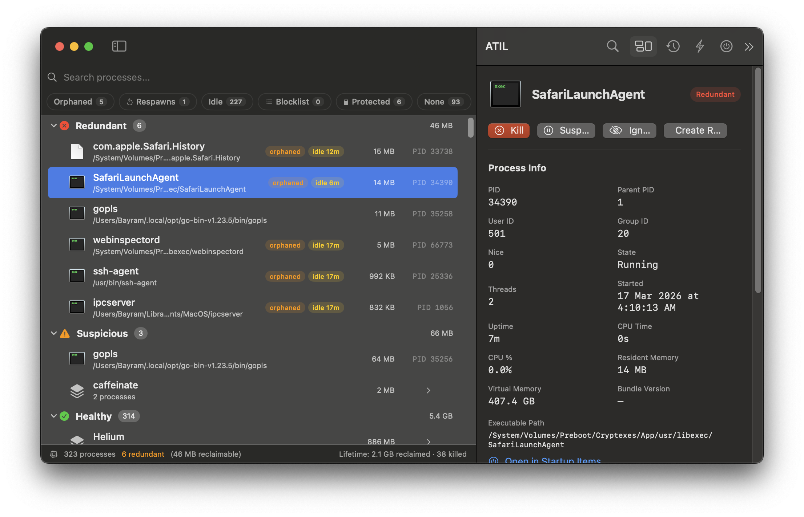
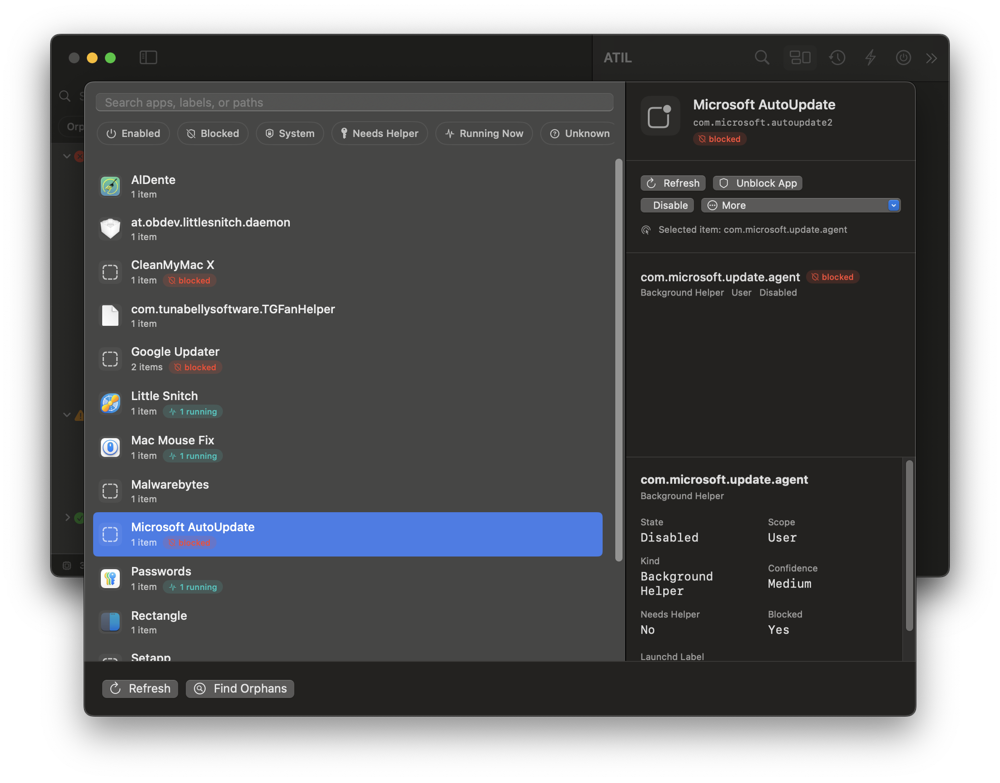

#  ATIL

A macOS app that keeps your system clean by finding unnecessary processes and giving you full control over what runs on your Mac.

<p align="center">
  
</p>

## What it does

ATIL scans every process on your Mac, figures out which ones are actually doing something useful, and sorts them into clear categories so you can deal with the rest.

**Smart Process Classification** — Every running process is automatically sorted into Redundant, Suspicious, or Healthy. ATIL detects orphaned processes (ones whose parent has disappeared), idle background tasks, and matches against a built-in blocklist of known updater daemons and telemetry agents.

**Kill, Suspend, or Ignore** — Select any process and kill it instantly, suspend it to free up resources, or mark it as ignored so ATIL leaves it alone. A detail panel shows everything about the process: memory usage, CPU time, threads, uptime, executable path, and more.

**Auto-Action Rules** — Set up rules that run automatically. Match processes by name, path, bundle ID, or regex pattern, then choose what happens: kill, suspend, or flag them. Add cooldown timers or limit rules to specific app contexts.

**Startup Items Manager** — See every app and background service that launches when your Mac starts. Disable login items, block launch agents, or bootout daemons you don't need — all from one place.

<p align="center">
  
</p>

**Session & Lifetime Stats** — Track how many processes you've killed and how much memory you've reclaimed, both for the current session and across your entire usage history.

## Install

Download the latest `.dmg` from [GitHub Releases](../../releases) and drag to Applications.

Requires macOS 14.0 (Sonoma) or later.

## Development

Built with Swift + SwiftUI, managed by [Tuist](https://tuist.io).

```bash
tuist install
tuist generate
open ATIL.xcworkspace
```
